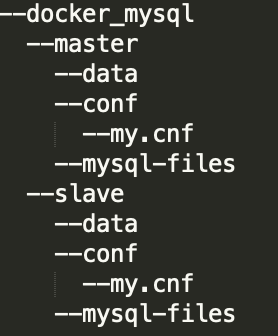

# MAC-mysql-master-slave-setup
在mac os下建立mysql主从服务

## 1.拉取MySQL5.7镜像到本地

```
docker pull mysql:5.7
```

## 2. 准备MySQL配置文件

创建如下图所示目录：



在master/conf/my.conf和slave/conf/my.conf中分别写入如下内容：

- master

```
[client]
default-character-set=utf8
[mysql]
default-character-set=utf8
[mysqld]
log_bin = log  #开启二进制日志，用于从节点的历史复制回放
collation-server = utf8_unicode_ci
init-connect='SET NAMES utf8'
character-set-server = utf8
server_id = 1  #需保证主库和从库的server_id不同， 假设主库设为1
replicate-do-db=fileserver  #需要复制的数据库名，需复制多个数据库的话则重复设置这个选项
```

- slave

```
[client]
default-character-set=utf8
[mysql]
default-character-set=utf8
[mysqld]
log_bin = log  #开启二进制日志，用于从节点的历史复制回放
collation-server = utf8_unicode_ci
init-connect='SET NAMES utf8'
character-set-server = utf8
server_id = 2  #需保证主库和从库的server_id不同， 假设从库设为2
replicate-do-db=fileserver  #需要复制的数据库名，需复制多个数据库的话则重复设置这个选项
```
## 3. Docker分别运行MySQL主/从两个容器

- 将mysql主节点运行起来
```
docker run --name mysql-master -d -p 13306:3306 -e MYSQL_ROOT_PASSWORD=123456 -v /Users/yourname/mysql_docker/master/data:/var/lib/mysql -v /Users/yourname/mysql_docker/master/conf/my.cnf:/etc/mysql/my.cnf -v /Users/yourname/mysql_docker/master/mysql-files:/var/lib/mysql-files mysql:5.7
```
运行参数说明:
>--name mysql-master: 容器的名称设为mysql-master
>-p 13306:3306: 将host的13306端口映射到容器的3306端口
>-v /Users/yourname/mysql_docker/master/conf/my.cnf:/etc/mysql/my.cnf ： master.conf配置文件挂载，yourname记得改为自己的用户名
>-v /Users/yourname/mysql_docker/master/data:/var/lib/mysql ： mysql容器内数据挂载到host的/data/mysql/datam， 用于持久化
>-e MYSQL_ROOT_PASSWORD=123456 : mysql的root登录密码为123456

- 将mysql从节点运行起来
```
docker run --name mysql-slave -d -p 13307:3306 -e MYSQL_ROOT_PASSWORD=123456 -v /Users/yourname/mysql_docker/slave/data:/var/lib/mysql -v /Users/yourname/mysql_docker/slave/conf/my.cnf:/etc/mysql/my.cnf -v /Users/yourname/mysql_docker/master/mysql-files:/var/lib/mysql-files mysql:5.7
```

## 4.登录MySQL主节点配置同步信息

- 登录mysql
```
# 192.168.1.xx 是你本机的内网ip
mysql -u root -h 192.168.1.xx -P13306 -p123456
```
- 在mysql client中执行

```
mysql> GRANT REPLICATION SLAVE ON *.* TO 'slave'@'%' IDENTIFIED BY 'slave';
mysql> flush privileges;
mysql> create database XXXXX default character set utf8mb4;
```
再获取status, 得到类似如下的输出:
```
mysql> show master status /G;
*************************** 1. row ***************************
File: log.00003
Position: 1035
Binlog_Do_DB: 
Binlog_Ignore_DB: 
Executed_Gtid_Set: 
1 row in set (0.00 sec)
```
## 5.登录MySQL从节点配置同步信息

- 另开一个tab登录mysql

```
# 192.168.1.xx 是你本机的内网ip
mysql -u root -h 192.168.1.xx -P13307 -p123456
```
- 在mysql client中操作:

```
mysql> stop slave;
#注意其中的日志文件和数值要和上面show master status的值对应
mysql> CHANGE MASTER TO MASTER_HOST='你的本地ip地址如192.168.1.x',master_port=13306,MASTER_USER='slave',MASTER_PASSWORD='slave',MASTER_LOG_FILE='log.00003',MASTER_LOG_POS=1035;
mysql> start slave;
```
再获取status, 正常应该得到类似如下的输出:
```
mysql> show slave status /G;
// ...
Slave_IO_Running: Yes 
Slave_SQL_Running: Yes 
// ...
```
